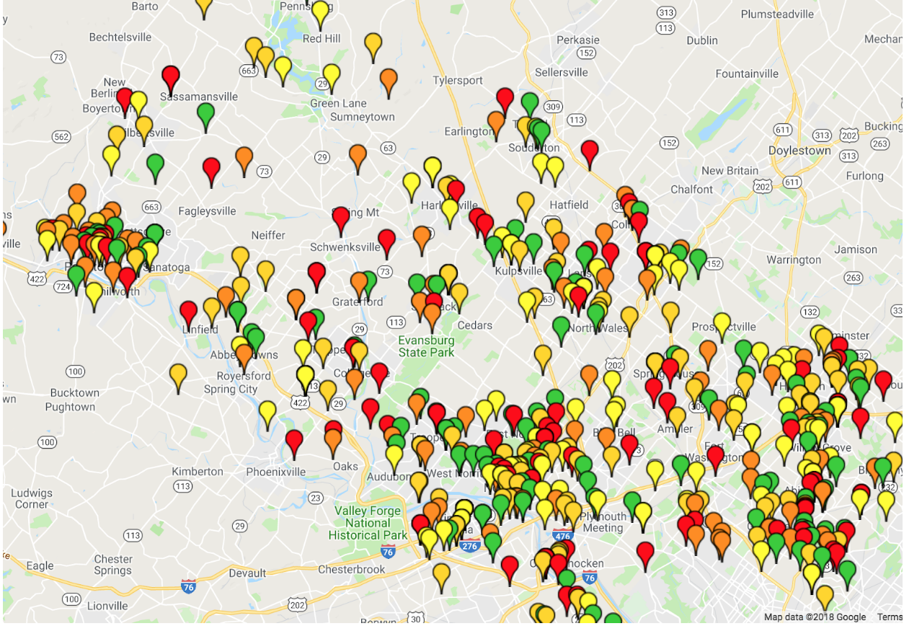

# AmbulanceNLP

## Ranks ambulance calls according to proximity and urgency using NLP to identify keywords from text.

First, the program will input an ambulance call in the form of a csv (comma separated values) which features including latitude, longitude, description, etc. A couple examples I  used can be found below:
https://data.cincinnati-oh.gov/Safer-Streets/Cincinnati-Fire-Incidents-CAD-including-EMS-ALS-BL/vnsz-a3wp/data
https://data.marincounty.org/Public-Health/Emergency-Medical-Service-Incidents/swth-izpe
Here is an example of what such a data set would look like.

Then, the program runs the data set through a word2vec program which finds related key words. This is what that output should be similar to.

The program then runs this through a priority algorithm which ranks the calls according to Medical Priority Dispatch Codes, which can be located here: https://wiki.radioreference.com/index.php/Priority_Dispatch_Codes

After ranking, using gmplot, which can be located here: https://github.com/vgm64/gmplot , the program maps the priorities to a map, using a different color for each priority.

*Pranav Eranki*
